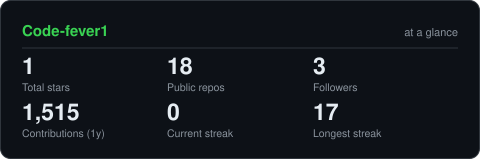
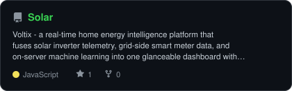
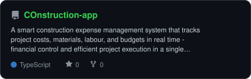
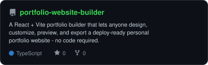
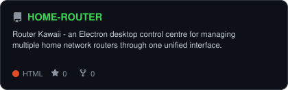

<div align="center">

<!-- PORTRAIT - generated by scripts/dotify.py from assets/jacket.png.
     Colour mode, so one file serves both GitHub themes. Regenerate with:
       python scripts/dotify.py assets/jacket.png -o assets/portrait \
         --cols 100 --equalize --detail 0.5 --color -->


<br>

<!-- NAME / TAGLINE - animated typing -->
<a href="https://github.com/Code-fever1">
  
</a>

<br>

<!-- SOCIALS -->
<a href="https://linkedin.com/in/syedalijah"></a>
<a href="mailto:alijahinnovates@gmail.com"></a>
<a href="https://syedalijah.dev"></a>
<a href="https://facebook.com/codecraft.alijah"></a>
<a href="https://instagram.com/codecraft.alijah"></a>


</div>

---

## `~/` whoami

```console
$ cat about.txt
```

Hi, I'm **Syed Alijah Muhammad** — a full-stack developer and systems engineer from Lahore, Pakistan.
I build real products that hold up in the real world: React and Next.js frontends, Node.js backends,
AI tooling, and the systems glue that keeps them running.

- Currently building **[Voltix](https://github.com/Code-fever1/Solar)** and **[Construction ERP](https://github.com/Code-fever1/COnstruction-app)**
- Portfolio: **[syedalijah.dev](https://syedalijah.dev)**
- Learning **AI agents + scalable backend architecture**
- Fun fact: **I wired my own home's solar inverter and smart meter into a live monitoring dashboard — my house tells me how much power it's using.**

<br>

<div align="center">

## `~/` toolbox


</div>

---

<div align="center">

## `~/` skill radar

<table>
<tr>
<td width="50%" align="center" valign="middle">

<!-- Self-rated radar - edit assets/skills.json, the workflow redraws it -->
<picture>
  <source media="(prefers-color-scheme: dark)"  srcset="assets/radar-dark.svg">
  <source media="(prefers-color-scheme: light)" srcset="assets/radar-light.svg">
  
</picture>

</td>
<td width="50%" align="center" valign="middle">

<!-- Live radar built from real language byte counts across your repos -->
<picture>
  <source media="(prefers-color-scheme: dark)"  srcset="assets/radar-langs-dark.svg">
  <source media="(prefers-color-scheme: light)" srcset="assets/radar-langs-light.svg">
  
</picture>

</td>
</tr>
</table>

</div>

---

<div align="center">

## `~/` contribution calendar

<!-- 3D isometric calendar, regenerated every 6h by .github/workflows/metrics.yml -->


<br><br>

<!-- Snake eats the contribution graph - .github/workflows/snake.yml -->
<picture>
  <source media="(prefers-color-scheme: dark)"  srcset="https://raw.githubusercontent.com/Code-fever1/Code-fever1/output/snake-dark.svg">
  <source media="(prefers-color-scheme: light)" srcset="https://raw.githubusercontent.com/Code-fever1/Code-fever1/output/snake.svg">
  
</picture>

</div>

---

<div align="center">

## `~/` the numbers

<!-- Generated by scripts/cards.py into this repo. Deliberately NOT
     github-readme-stats / streak-stats / github-profile-trophy: those are
     shared public instances that go down and take the whole section with them. -->
<picture>
  <source media="(prefers-color-scheme: dark)"  srcset="assets/card-stats-dark.svg">
  <source media="(prefers-color-scheme: light)" srcset="assets/card-stats-light.svg">
  
</picture>

<br>


<br><br>


</div>

---

<div align="center">

## `~/` selected work

<!-- Cards generated by scripts/cards.py from assets/projects.json.
     Stars, forks and language are pulled live from the API on every run. -->
<table>
<tr>
<td width="50%">
  <a href="https://github.com/Code-fever1/Solar">
    <picture>
      <source media="(prefers-color-scheme: dark)"  srcset="assets/card-Solar-dark.svg">
      <source media="(prefers-color-scheme: light)" srcset="assets/card-Solar-light.svg">
      
    </picture>
  </a>
</td>
<td width="50%">
  <a href="https://github.com/Code-fever1/COnstruction-app">
    <picture>
      <source media="(prefers-color-scheme: dark)"  srcset="assets/card-COnstruction-app-dark.svg">
      <source media="(prefers-color-scheme: light)" srcset="assets/card-COnstruction-app-light.svg">
      
    </picture>
  </a>
</td>
</tr>
<tr>
<td width="50%">
  <a href="https://github.com/Code-fever1/portfolio-website-builder">
    <picture>
      <source media="(prefers-color-scheme: dark)"  srcset="assets/card-portfolio-website-builder-dark.svg">
      <source media="(prefers-color-scheme: light)" srcset="assets/card-portfolio-website-builder-light.svg">
      
    </picture>
  </a>
</td>
<td width="50%">
  <a href="https://github.com/Code-fever1/HOME-ROUTER">
    <picture>
      <source media="(prefers-color-scheme: dark)"  srcset="assets/card-HOME-ROUTER-dark.svg">
      <source media="(prefers-color-scheme: light)" srcset="assets/card-HOME-ROUTER-light.svg">
      
    </picture>
  </a>
</td>
</tr>
</table>

<sub>

| project | live | stack |
|---|---|---|
| **[Solar](https://github.com/Code-fever1/Solar)** | — | `TypeScript` `React Native` `Node.js` |
| **[COnstruction-app](https://github.com/Code-fever1/COnstruction-app)** | [construction-cms-prototype.html-5.me](https://construction-cms-prototype.html-5.me) | `TypeScript` `React` `Express` `PostgreSQL` |
| **[portfolio-website-builder](https://github.com/Code-fever1/portfolio-website-builder)** | [your-portfolio-by-alijah.web1337.net](https://your-portfolio-by-alijah.web1337.net) | `TypeScript` `React` `Vite` `Tailwind` |
| **[HOME-ROUTER](https://github.com/Code-fever1/HOME-ROUTER)** | [home-router-prototype.html-5.me](https://home-router-prototype.html-5.me) | `JavaScript` `Electron` |

</sub>

</div>

---

<div align="center">

<sub>`01100010 01110101 01101001 01101100 01110100 00100000 01100010 01111001 00100000 01100001 01101100 01101001 01101010 01100001 01101000`</sub>

</div>
